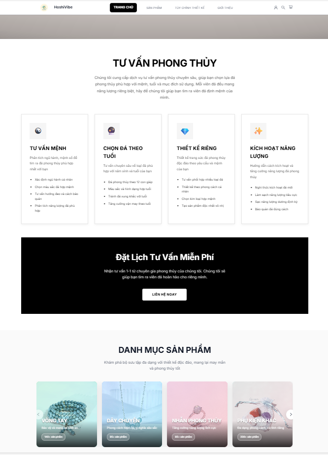
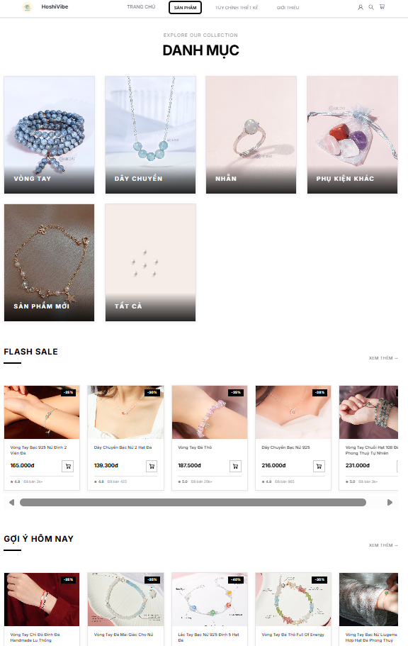
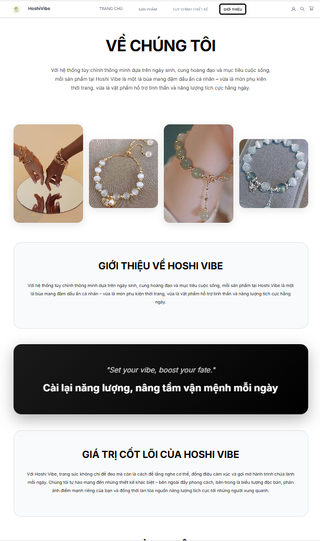

# HoshiVibe Backend

Backend API cho HoshiVibe Web, xây dựng với ASP.NET Core 8. Tập trung vào hiệu năng, bảo mật và quy trình nghiệp vụ cho sản phẩm/đơn hàng.

- Live site: https://fe-hoshi-vibe.vercel.app/

## Screenshots

<p align="center">
  
  
  
</p>

## Features

- RESTful APIs: product, cart, order, voucher, user profile, dashboard
- Auth: JWT + Google OAuth
- Payments: VNPAY, MoMo
- Swagger/OpenAPI docs
- Layered architecture: Controllers / Service / Repository / Entities

## Tech Stack

- ASP.NET Core 8, C#
- EF Core 9, AutoMapper
- PostgreSQL (Npgsql)
- JWT, Swashbuckle

## Quick Start

```bash
dotnet restore
dotnet run
```

Cấu hình môi trường trong `.env` hoặc `appsettings.json`. Swagger mặc định tại `http://localhost:5243/swagger` (hoặc `https://localhost:7217/swagger`).
